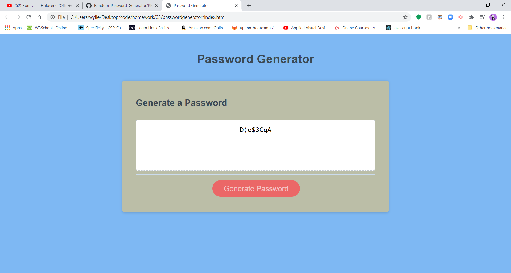
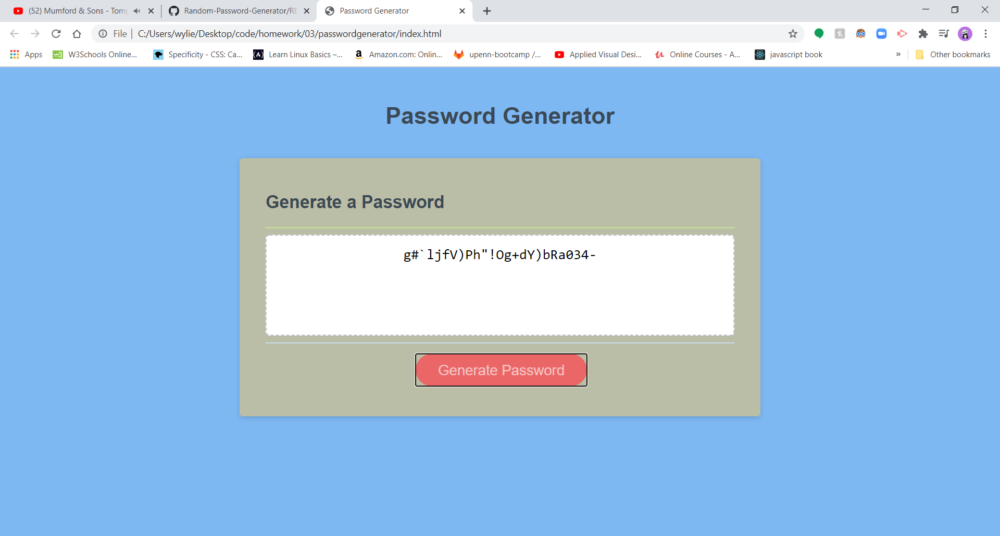
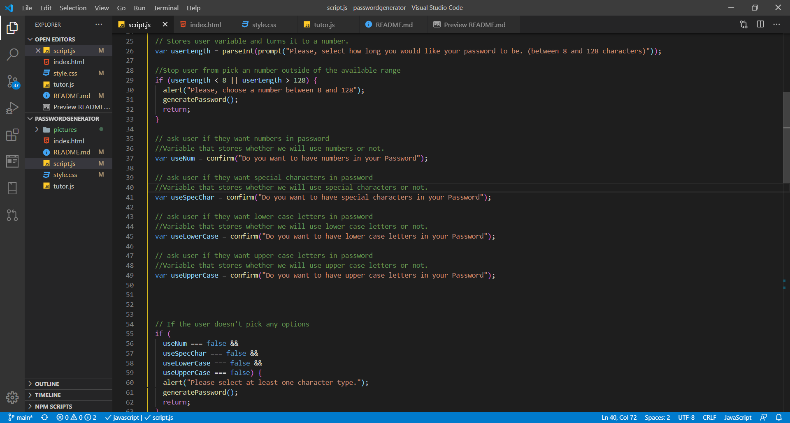

# Passwordgenerator

## Description

This site generates a password tailored to user preference.  It begins with user clicking a button and being prompted to give a specified length. Then, confirming what specific parameter will be added to the password.  Afterwards, the generator displays a randomly generated password for the user to use.

### Operating

The application makes use of Javascript to do the required actions to generate a random password.  We first start off with an event listener, "button click".  The website prompts the user for the password length. Then it follows with a series of confirmation methods that get the user's preferences.  We then start to make an array of the user's preferences with some if statements.  After we start to create a password by using a for loop and Math methods to generate a random value. Lastly, we return that value to the screen.

## ScreenShots

Several screenshots the website and code

## Credits

* [W3 schools - Javascript links to method and other helpful tools](https://www.w3schools.com/js/default.asp)
* [Dzone website - An article on several ways to combine arrays](https://dzone.com/articles/ways-to-combine-arrays-in-javascript#:~:text=First%2C%20declare%20an%20empty%20array,called%20a%20two%2Ddimensional%20array.)
* [Stack Overflow- trouble shooting with errors](https://stackoverflow.com/questions/62910135/type-error-on-line-cannot-read-property-push-of-undefined)
